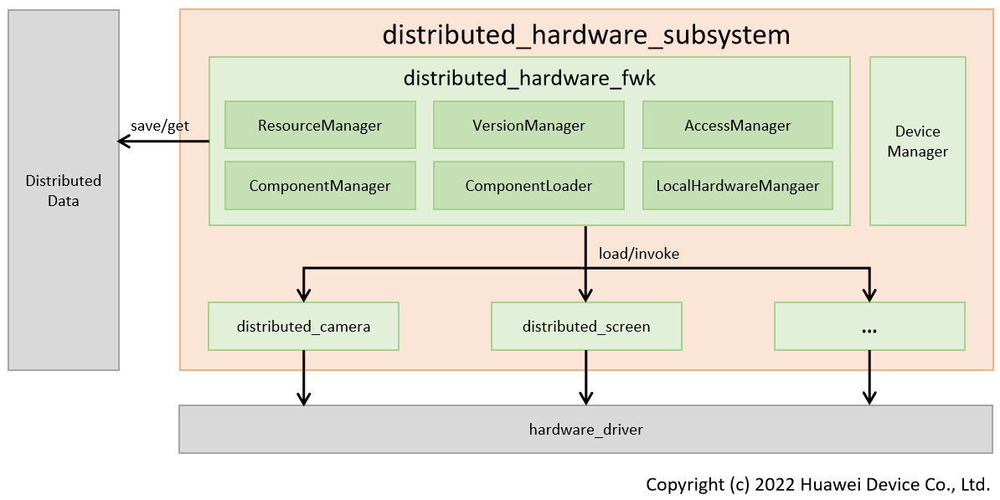

# **分布式硬件管理框架**

## **简介**

分布式硬件管理框架是为分布式硬件子系统提供信息管理能力的部件。分布式硬件管理框架为分布式硬件子系统提供统一的硬件接入、查询和使能等能力。

其系统架构图如下图所示：



**硬件接入管理(AccessManager)**：硬件接入管理模块对接设备管理（DeviceManger）子系统，用于处理设备的上下线事件响应。

**硬件资源管理(ResourceManager)**：对接分布式数据服务，用于存储信任体系内，本机和周边设备同步过来的设备硬件信息。

**分布式硬件部件管理(ComponentManager)**：对接各分布式硬件实例化的部件，实现对分布式硬件的动态加载和使能/去使能等操作。

**本地硬件信息管理(LocalHardwareManager)**：用于采集本地硬件信息，并通过ResourceManager进行硬件信息的持久化存储；同时，通过对接硬件驱动，用于感知本地硬件的插拔等操作，感知是否新增或移除可用硬件，将动态变化的硬件设备也纳入分布式硬件管理。

**部件加载管理(ComponentLoader)**：用于解析部件配置文件，按需加载部件驱动的实现so，获取驱动外部接口函数句柄以及实现版本，供其他业务使用。

**版本管理(VersionManager)**：用于管理超级终端内，各个设备的分布式硬件平台和分布式硬件部件的版本号，供分布式硬件业务各个部件业务使用。

## **目录**

```
/foundation/distributedhardware/distributed_hardware_fwk
├── common                                  # 分布式硬件管理框架为各个部件提供的公共接口类
├── sa_profile                              # 分布式硬件管理框架的SA配置信息
├── services                                # 分布式硬件管理框架的SA具体实现
│   └── distributedhardwarefwkservice       # 分布式硬件管理框架的服务层
│       ├── accessmanager                   # 硬件接入管理
│       ├── resourcemanager                 # 硬件资源管理
│       ├── componentmanager                # 分布式硬件部件管理
│       ├── localhardwaremanager            # 本地硬件信息管理
│       ├── componentloader                 # 部件加载管理
│       └── versionmanager                  # 版本管理
└── utils                                   # 分布式硬件管理框架为各个部件提供的工具类
```

## **约束**
**语言限制**：C++语言。  
**组网环境**：必须确保设备在同一个局域网中。  
**操作系统限制**：OpenHarmony操作系统。  

## **说明**
### **接口说明**
1.分布式硬件管理框架不提供北向接口，由各个硬件提供管理接口供开发者调用。  
2.分布式硬件管理框架只提供接口供各个分布式硬件(例如分布式相机、分布式屏幕)实现，分布式硬件管理框架统一调用这些接口，实现分布式硬件的虚拟硬件驱动注册等功能。

### **流程说明**
#### **1. 设备开机启动**
系统拉起分布式硬件管理框架的SA服务，AccessManager会进行初始化，AccessManager初始化DeviceManger并且注册上下线监听。

#### **2. 设备组网上线**
(1) DeviceManger触发上线监听回调。  
(2) ResourceManager、ComponentLoader、LocalHardwareManager、VersionManager 、ComponentManager各个模块依次初始化。  
(3) 分布式硬件管理框架内部会构造上线任务，使能各个分布式硬件部件。

以分布式相机为例，某设备上线后，分布式硬件管理框架同步到上线设备的相机硬件信息并使能，使能成功后在系统中会新增分布式相机驱动并通知到相机框架，相机框架统一管理本地相机和分布式相机驱动；上层应用通过相机框架接口可以查询到分布式相机，并按照和本地相机相同的接口使用分布式相机。

#### **3. 设备下线**
(1) DeviceManger触发下线监听回调。  
(2) 分布式硬件管理框架内部会构造下线任务，去使能各个分布式硬件部件。

以分布式相机为例，某设备下线后，分布式硬件管理框架去使能下线设备的相机硬件，本地移除分布式相机驱动并通知到相机框架，此时下线设备的分布式相机不可用。

## **涉及仓**

**分布式硬件子系统：**  

设备管理
[device_manager](https://gitee.com/openharmony/device_manager)

**分步式硬件管理框架
[distributed_hardware_fwk](https://gitee.com/openharmony/distributed_hardware_fwk)**

分布式相机
[distributed_camera](https://gitee.com/openharmony/distributed_camera)

分布式屏幕
[distributed_screen](https://gitee.com/openharmony/distributed_screen)


